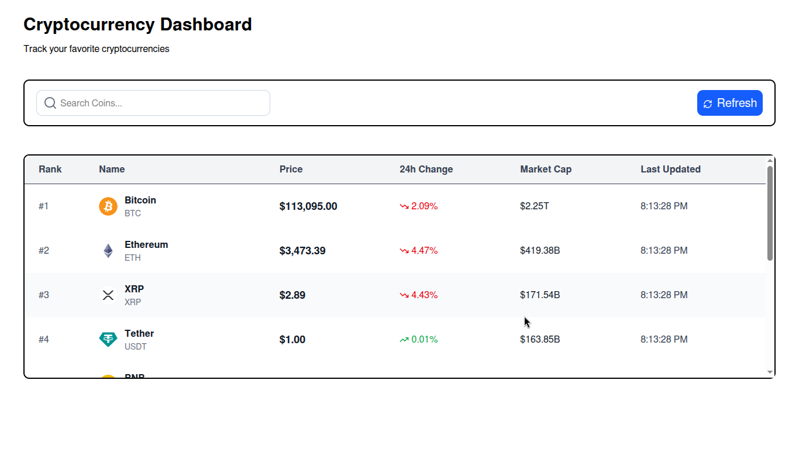
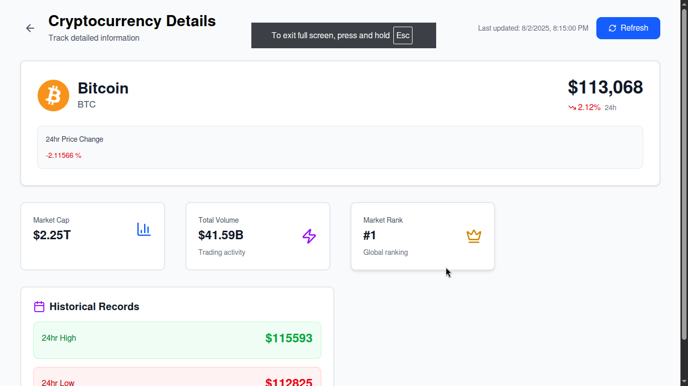
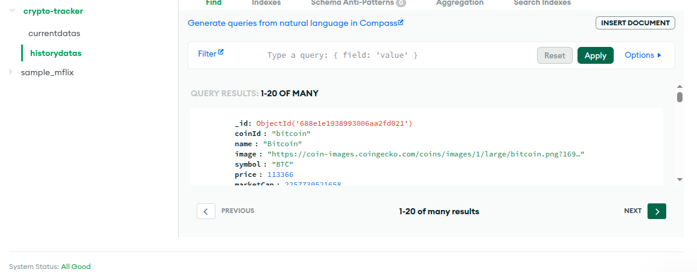
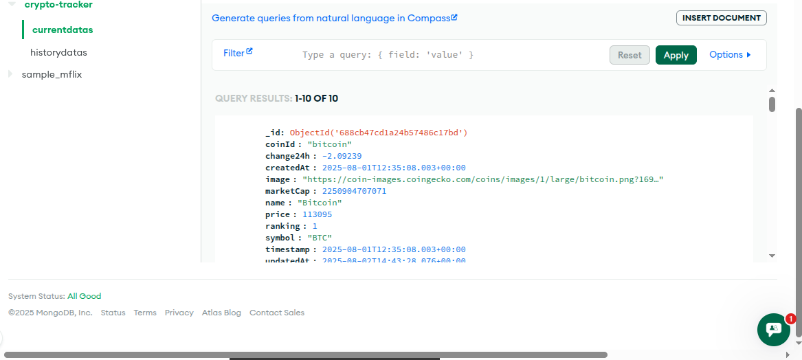
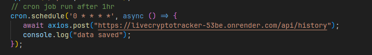

#  Crypto Tracker – VR Automations Developer Test

A full-stack MERN cryptocurrency tracker that displays the top 10 cryptocurrencies in real time using the CoinGecko API, and stores hourly price snapshots for historical data and future charting.

---
# Live Website
CryptoTracker =>  https://cryptotracker-aee1b.web.app/ 

🖼️ Screenshots




### 📁 MongoDB Data Snapshot





### 🔁 Cron Job Log




##  Deployment Links
| Service     | URL                                                                                  

|  Client | https://cryptotracker-aee1b.web.app/ 
|  Server  | https://invigorating-transformation-production.up.railway.app   


##  Tech Stack Used

###  Client
- React (Vite)
- TypeScript
- Zustand (for global state)
- Axios
- Tailwind CSS

###  Server
- Node.js
- Express.js
- Axios
- Mongoose
- node-cron

###  Database
- MongoDB Atlas

---

##  Setup & Installation

###  Prerequisites
- Node.js (v18+)
- MongoDB Atlas URI
- Git CLI

---

 1. Clone the Repository

```bash
git clone https://github.com/guptamanish3239/crypto-tracker.git
cd crypto-tracker


Project structure:

/crypto-tracker
├── /Client # React Client
└── /Server  # Express Server

### 2. Server Setup (/server)

cd Server
npm install

Create a .env file:

PORT=5000
MONGO_URI=MONGODB_URI=mongodb+srv://<username>:<password>@cluster0.e7tifv9.mongodb.net/crypto-tracker?retryWrites=true&w=majority&appName=Cluster0

Run the Server:
npm run dev

💻 3. Client Setup (/client)

cd ../Client
npm install
npm run dev


⏱️ How the Cron Job Works
A cron job using node-cron runs every 30 minutes

It calls the Server endpoint: POST /api/history

This endpoint fetches the top 10 coins from CoinGecko

Each coin is stored with a timestamp in the HistoryData collection

Render logs also show the job running 


